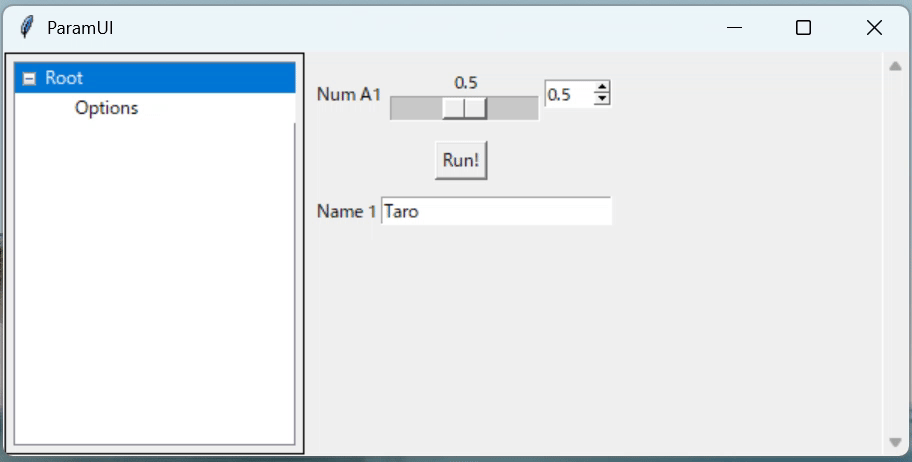

# ParamUI

ParamUI is a Python framework for easy parameter management and GUI creation. It automatically generates a Tkinter-based GUI from a ParameterTable and synchronizes values with a nested Prm structure.

## ✨ Features
- Auto-generates GUI from Parameter Table
- Parameters are mapped to a nested Prm structure
- Tree navigation using path syntax
- Supports slider, selector, button, checkbox, file browser, and textbox widgets
- Headless mode is supported for testing without a GUI

## 📦 Installation
### Method 1: Install using pip:
```bash
pip install git+https://github.com/covao/ParamUI
```
### Method 2: Download the source code
Download [paramui.py](./paramui/paramui.py) and place it in your project directory

## Uninstall
```bash
pip uninstall paramui
```

## Example
~~~python
from paramui import paramui
import time

    ParameterTable = [
        ['A1','Num 1',0.5, [0, 1, 0.1]],                    # A1: pu.Prm.A1
        ['Options/Flag','Flag 1',True,[]],                 # Options/Flag: pu.Prm.Settings.Flag  
        ['Run','Run!',False,'button'],                      # Run: pu.Prm.Run
        ['Options/Select','Select 1','Two',['One','Two','Three']], # Options/Select: pu.Prm.Options.Select
        ['Name','Name 1','Taro',[]]                  # Name: pu.Prm.Person.Name
    ]
    
    # Create paramui instance
    pu = paramui(ParameterTable)
    while pu.IsAlive:
        pu.update_prm()  # Update Prm Variables from UI
        if  pu.Prm.Run:  # If Run button is pressed
            print("Run button pressed!")
            pu.Prm.Run = False  # Reset button state of the Prm Variable
            print(f"Name:", pu.Prm.Name, "Options/Flag:", pu.Prm.Options.Flag, "A1:", pu.Prm.A1)
        time.sleep(0.1)
    print("paramui finished.")
~~~



## Parameter Table Structure
The "Parameter Table" is a list of lists, where each inner list defines a parameter:
- 'Path of parameter', 'Display Name', Default_value, Range or options
- Example:
```python
ParameterTable = [
    ['A1', 'Num 1', 0.5, [0, 1, 0.1]],  # Slider with range [min, max, step]
    ['Run', 'Run!', False, 'button'],  # Button
    ['Flag', 'Flag 1', True, []],  # Checkbox
    ['Text', 'Text Input', 'ABC', 'text'],  # Textbox
    ['File', 'File Path', '*.txt', 'file'],  # File browser
    ['Selector', 'Select Option', 'Option1', ['Option1', 'Option2', 'Option3']],  # Selector with options
    # Add more parameters as needed
]
```
 
## API Reference
- paramui(parameter_table, show_ui=True): Create the parameter UI and structure. If `show_ui` is False, runs in headless mode.
- close_ui(): Close the UI window.
- update_prm(): Synchronize UI values to Prm structure.
- Prm: Nested parameter structure.
- IsAlive: True if the UI is running.


