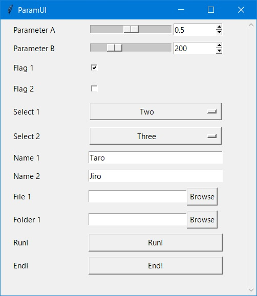

# ParamUI Python  
- Create App with UI from simple parameter table
- Easy code generation using ChatGPT

# Instalation
## Method 1
- Install library in python environment
~~~
pip install git+https://github.com/covao/ParamUI

~~~
## Method 2
- Download [paramui.py](https://github.com/covao/ParamUI/blob/main/paramui/paramui.py) and copy to the folder where you run the python script 

# Usage
## Parameter table definition
Parameter table is containing the following columns  
- Prameter Variable
- Parameter Label
- Initial Value
- Range 
  - Slider: [Min,Max,Step],
  - Selecter: ['A','B'...]
  - FileName: '*.txt;*.doc'
  - Button: 'button'

~~~ python
# Hello ParamUI
from paramui import paramui

ParameterTable = [
    ['A', 'Parameter A', 0.5, [0, 1, 0.1]],
    ['B', 'Parameter B This is a pen', 200, [100, 500, 10]],
    ['F1', 'Flag 1', True, []],
    ['F2', 'Flag 2', False, []],
    ['S1', 'Select 1', 'Two', ['One', 'Two', 'Three']],
    ['S2', 'Select 2', 'Three', ['One', 'Two', 'Three']],
    ['Name1', 'Name 1', 'Taro', []],
    ['Name2', 'Name 2', 'Jiro', []],
    ['File1', 'File 1', '', '*.py;*.txt'],
    ['Folder1', 'Folder 1', '', 'folder'],
    ['Run', 'Run!', False, 'button'],
]

~~~
## Example 1: Click & Run
~~~ python
def usrfunc(Prm):
    if not Prm.Run:
        return
    print(Prm)
paramui(ParameterTable, usrfunc)

~~~
## Example 2: Loop & Get Parameters
~~~ python
pu = paramui(ParameterTable)
while pu.IsAlive:
    print(pu.Prm)
    time.sleep(0.5)
    
~~~

## Hello ParamUI

- [hello_paramui.py](https://github.com/covao/ParamUI/blob/main/example/hello_paramui.py)

# ParamUI Prompt Designer
- Generate prompt of UI app using LLM
Try prompt! e.g. ChatGPT, Bing Chat, Bard  
[Start Prompt Designer!](https://covao.github.io/ParamUI/html/paramui_prompt_designer.html)

# Demo
- Lifegame
- Mandelblot

# Related Sites
- [ParamUI MATLAB](https://github.com/covao/ParamUI_MATLAB)

