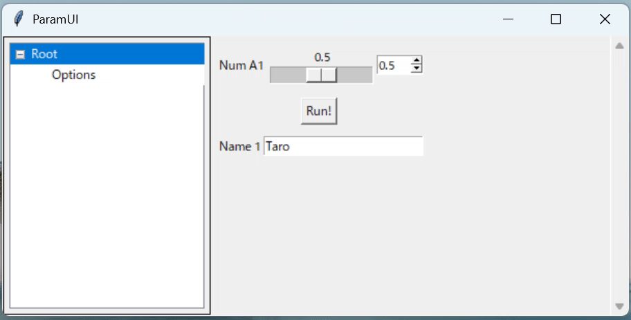

# ParamUI

ParamUI is a Python framework for easy parameter management and GUI creation. It automatically generates a Tkinter-based GUI from a ParameterTable and synchronizes values with a nested Prm structure.

## ✨ Features
- Auto-generates GUI from Parameter Table
- Easy generation of the GUI using LLMs such as ChatGPT
- Parameters are mapped to a nested Prm structure
- Tree navigation using path syntax
- Supports slider, selector, button, checkbox, file browser, and textbox widgets
- Regex pattern validation for textbox inputs
- Scrollable UI for large parameter sets
- Navigation tree auto-minimizes when the parameter hierarchy has no sub-levels
- Headless mode is supported for testing without a GUI

## 📦 Installation
### Supported Environment
- OS: Windows, Linux
- Python: 3.7 or later

### Method 1: Download to the current folder using wget:
```bash
wget https://raw.githubusercontent.com/covao/ParamUI/main/paramui.py
```
### Method 2: Download the source code
Download [paramui.py](./paramui.py) and place it in your project directory

### Uninstall
Delete `paramui.py` from your project directory.

## 📋 Example
~~~python
from paramui import paramui
import time
# Example parameter table
ParameterTable = [
    ['A1','Num A1',0.5, [0, 1, 0.1]], # pu.Prm.A1
    ['Options/Flag1','Flag 1',True,[]], # pu.Prm.Options.Flag1
    ['Run','Run!',False,'button'], # pu.Prm.Run
    ['Options/Select1','Select 1','Two',['One','Two','Three']], # pu.Prm.Options.Select1
    ['Name1','Name 1','Taro',[]] # pu.Prm.Name1
]

# Create paramui instance
pu = paramui(ParameterTable)
while pu.IsAlive:
    pu.update_prm()  # Update Prm Variables from UI
    if  pu.Prm.Run:  # If Run button is pressed
        print("Run button pressed!")
        pu.Prm.Run = False  # Reset button state of the Prm Variable
        print(f"Name:", pu.Prm.Name1, ", Options/Flag:", pu.Prm.Options.Flag1, ", Options/Select:", pu.Prm.Options.Select1, ", A1:", pu.Prm.A1)
    time.sleep(0.1) # Prevent busy-waiting
print("paramui finished.")
~~~



## Parameter Table Structure
"Parameter Table" is a list that manages parameters to be displayed in the UI.
 - 'Path of parameter', 'Display Name', Default_value, Range or options
- Example:
```python
ParameterTable = [
    ['A1', 'Num 1', 0.5, [0, 1, 0.1]],  # Slider with range [min, max, step]
    ['Run', 'Run!', False, 'button'],  # Button
    ['Flag', 'Flag 1', True, []],  # Checkbox
    ['Text', 'Text Input', 'ABC', []],  # Textbox
    ['Name', 'Name', 'Taro', '[A-Za-z ]{0,32}'],  # Textbox with regex pattern validation
    ['Options/File', 'File Path', '*.txt', 'file'],  # File browser
    ['Options/Selector', 'Select Option', 'Option1', ['Option1', 'Option2', 'Option3']],  # Selector with options
    # Add more parameters as needed
]
```

### Regex pattern validation for textboxes
If a regex pattern string (e.g. `'[A-Za-z ]{0,32}'`) is given as the Range/options field for a string-valued
parameter, the parameter is rendered as a textbox whose value is validated against that pattern with `re.fullmatch`.
- While typing, the text is checked on every keystroke; the text color turns **red** whenever it doesn't match
  the pattern, and back to normal once it matches again.
- When the textbox loses focus (or focus moves to another UI element) while the text still doesn't match the
  pattern, the textbox reverts to its last valid (current) value, and the invalid text is never written to `Prm`.
 
## Navigation Tree
ParamUI shows a navigation tree on the left for parameters organized under sub-paths (e.g. `Options/Flag1`).
If every parameter in the table is at the Root level (no `/` in any parameter path), the navigation tree is
not needed, so it is automatically minimized to the left edge of the window.

## API Reference
- paramui(parameter_table, show_ui=True): Create the parameter UI and structure. If `show_ui` is False, runs in headless mode.
- close_ui(): Close the UI window.
- update_prm(): Synchronize UI values to Prm structure.
- Prm: Nested parameter structure.
- IsAlive: True if the UI is running.

## 🎬 Demonstrations
- [Hello World](./example/hello_paramui.py)
- [Life game simulation](./example/lifegame_paramui.py)
- [Mandelbrot set generation](./example/mandelbrot_paramui.py)

